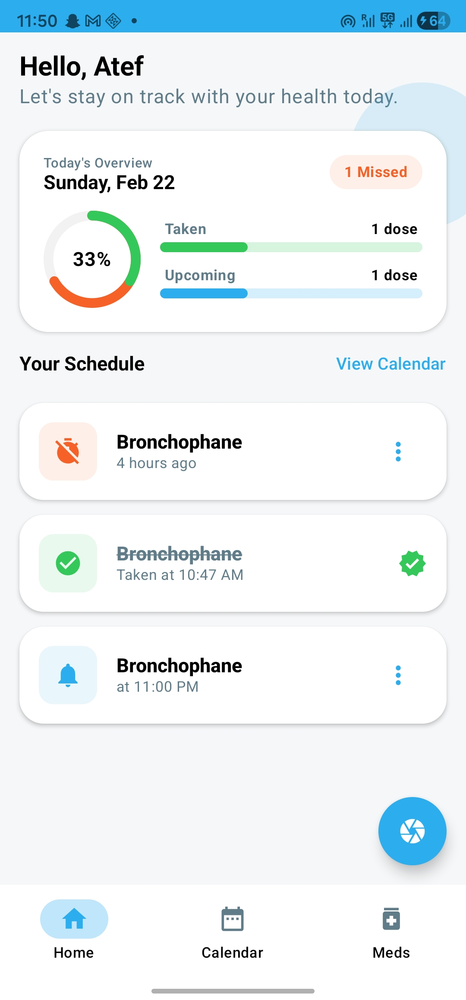
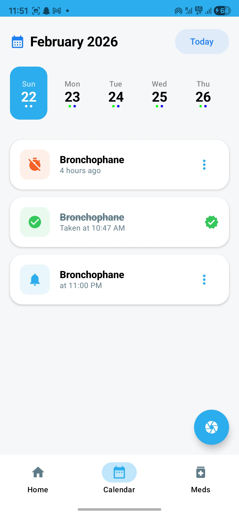
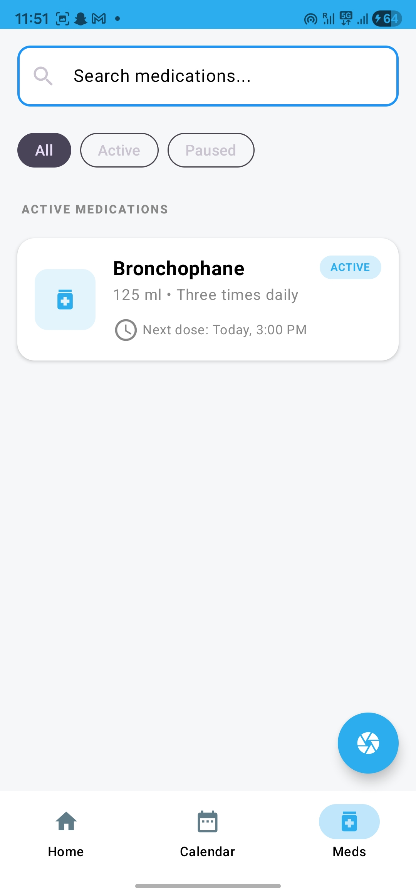
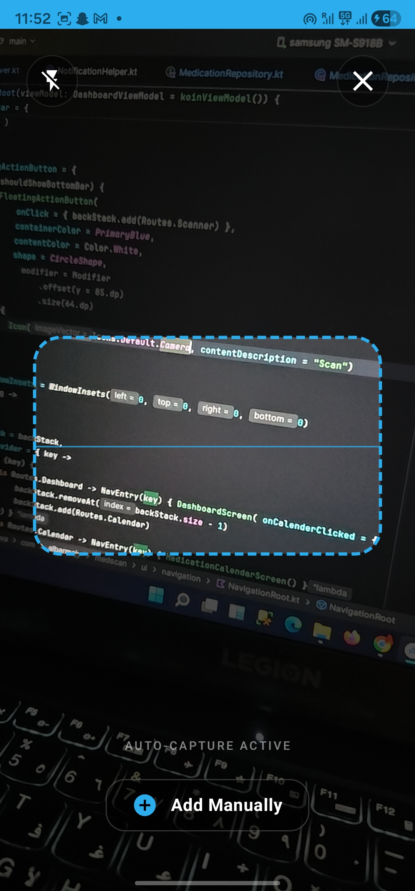
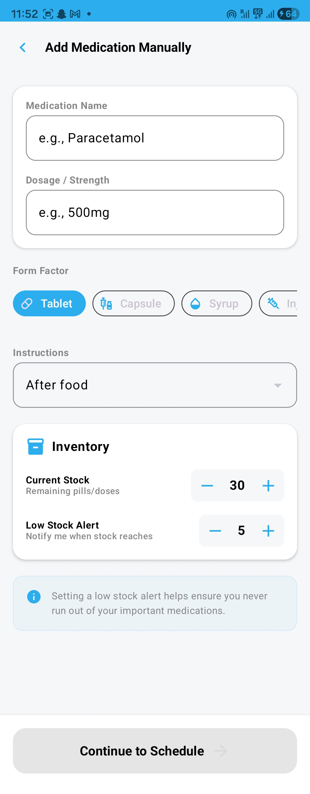
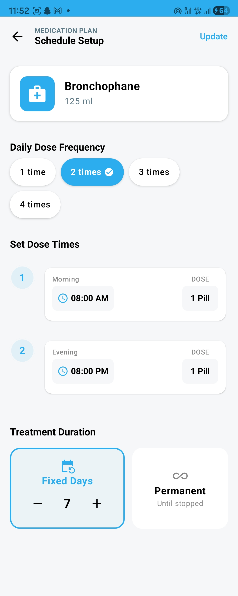
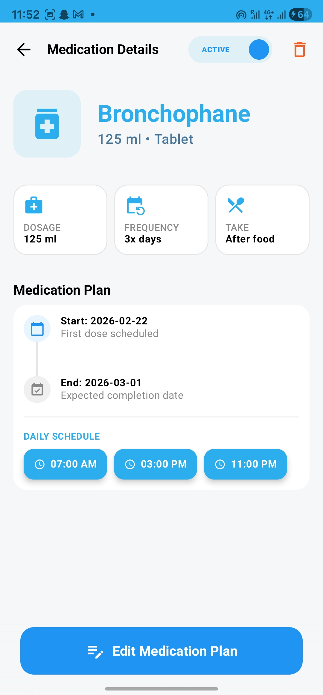

# MedRemind 💊
### Advanced Medication Tracker & Smart Reminder System


**MedRemind** is a professional, production-ready Android application built to help users adhere to their treatment plans with precision. It leverages modern Android standards to provide a reliable, offline-first experience with a focus on high-performance scheduling.

---

## 📸 App Preview

| **Home & Daily Doses** | **Treatment Calendar** | **Medication Inventory** |
|:---:|:---:|:---:|
|  |  |  |
| *Real-time dose tracking.* | *Visual timeline of plans.* | *Manage all medications.* |

| **AI Camera Entry (OCR)** | **Manual Add Form** | **Plan & Schedule Editor** | **Details of Medication & Plan** |
|:---:|:---:|:---:|:---:|
|  |  |  |  |
| *Auto-scan via Camera.* | *Detailed manual input.* | *Custom scheduling logic.* | *Preview medication details.* |

---

## 🛠 Tech Stack

- **UI:** Jetpack Compose (Material 3).
- **Architecture:** Clean Architecture (Domain, Data, Presentation).
- **Dependency Injection:** Koin.
- **Local Database:** Room (Offline-first).
- **Background Tasks:** - **AlarmManager:** Precision-timed medication reminders.
    - **BroadcastReceivers:** System-level event handling (Boot & Alarms).
- **Language:** Kotlin Coroutines & Flow.

---

## 🏗 Key Engineering Challenges Solved

### 1. Reliable Scheduling Engine
Implementing a robust reminder system using `AlarmManager`. I solved the challenge of **system reboots** by implementing a `BOOT_COMPLETED` receiver that automatically reschedules all active doses from the **Room database** back into the system alarm service.

### 2. Actionable Notifications
Designed custom notifications with **direct actions** (Done / Snooze). Used **KoinComponent** inside `BroadcastReceivers` to inject repositories and update the database state without requiring the user to open the app.

### 3. AI-Powered Data Entry
Integrated **ML Kit** for Optical Character Recognition (OCR) to allow users to scan medication labels, significantly reducing manual data entry errors.

---

## 🏗 Project Architecture & Structure

The project is built following **Clean Architecture** principles, separating concerns into three distinct layers to ensure highly maintainable, scalable, and testable code.

### 📁 Package Hierarchy
```text
com.albarmajy.medscan
├── 📂 data                  # Implementation of data sources
│   ├── 📂 alarm            # AlarmManager & BroadcastReceivers for scheduling
│   ├── 📂 local            # Local persistence (Room Database)
│   │   ├── 📂 converters   # TypeConverters for complex data (e.g., Dates)
│   │   ├── 📂 dao          # Data Access Objects (SQL queries)
│   │   ├── 📂 entities     # Room Database Tables
│   │   ├── 📂 relation     # Database relationships (One-to-Many, etc.)
│   │   ├── 📂 worker       # WorkManager for background synchronization
│   │   └── AppDatabase.kt  # Main Room database configuration
│   ├── 📂 mapper           # Data Mappers (Entity <-> Domain Model)
│   └── 📂 repository       # Repository Implementation logic
│
├── 📂 domain                # Pure Business Logic (Framework independent)
│   ├── 📂 alarm            # Alarm interfaces and domain models
│   ├── 📂 model            # Domain-specific entities
│   ├── 📂 repository       # Repository Interfaces (Abstractions)
│   └── 📂 use_case         # Interactors (Single action business rules)
│
├── 📂 di                    # Dependency Injection (Koin Modules)
├── 📂 notification          # Notification Builder & Channel management
│
└── 📂 ui                    # Presentation Layer (Jetpack Compose)
    ├── 📂 customUi         # Reusable custom UI components
    ├── 📂 navigation       # Type-safe Navigation Graph
    ├── 📂 scanner          # Camera & ML Kit OCR scanning logic
    ├── 📂 screens          # Main UI Screens (Home, Calendar, Meds)
    ├── 📂 theme            # Material 3 Design System (Colors, Typography)
    └── 📂 viewModels       # State management and UI logic
```

## 🚀 How to Run the Project

1. Clone the repository:
   ```bash
   git clone https://github.com/mo7amedtaym/medscan.git
2. Open the project in Android Studio

3. Run the app on an emulator or physical device


## 🧑‍💻 Author

**Mohamed Tayee**  
Android Developer | Kotlin Enthusiast | Clean Architecture Advocate  

📧 **Email:** [taym6116@gmail.com](mailto:taym6116@gmail.com)  
💼 **LinkedIn:** [linkedin.com/in/mohamed-atef-tayee](https://www.linkedin.com/in/mohamed-atef-tayee/)  
🐙 **GitHub:** [@mo7amedtaym](https://github.com/mo7amedtaym)


